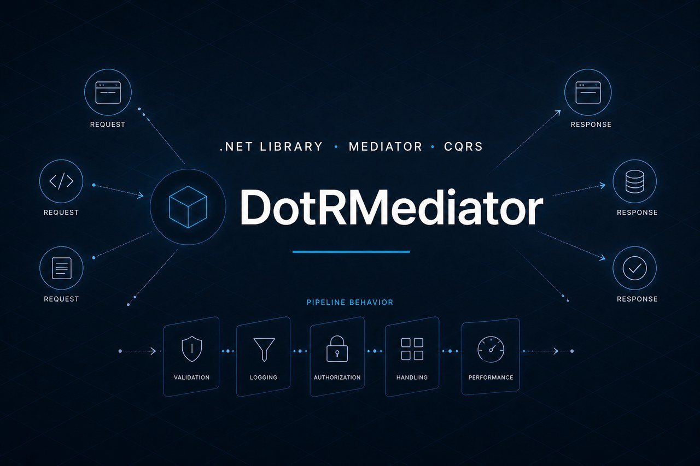

<p align="center">
  
</p>

# DotRMediator

[](https://dotnet.microsoft.com/)
[](LICENSE)

**DotRMediator** is a .NET library that implements the **Mediator** pattern in-process, inspired by [MediatR](https://github.com/jbogard/MediatR). It decouples senders from handlers, supports **CQRS** architectures, and enables pipeline composition for cross-cutting concerns such as validation, logging, and exception handling.

---

## Table of contents

- [Why use it?](#why-use-it)
- [Installation](#installation)
- [Quick start](#quick-start)
- [Features](#features)
- [Documentation](#documentation)
- [Running tests](#running-tests)
- [Comparison with MediatR](#comparison-with-mediatr)
- [License](#license)

---

## Why use it?

DotRMediator centralizes application communication through typed messages:

- **Commands/Queries (Request/Response):** one handler per request
- **Notifications/Events:** fan-out to multiple handlers
- **Pipeline Behaviors:** middleware for cross-cutting concerns
- **Stream Requests:** asynchronous responses via `IAsyncEnumerable<T>`
- **Exception Handling:** handlers and actions for request failures

No heavy dependencies — only `Microsoft.Extensions.DependencyInjection`.

---

## Installation

Add a project reference:

```bash
dotnet add package DotRMediator
```

Or reference the project directly:

```bash
dotnet add src/MyApp/MyApp.csproj reference src/DotRMediator/DotRMediator.csproj
```

---

## Quick start

### 1. Define a request and its handler

```csharp
public sealed record GetUserByIdQuery(int UserId) : IRequest<UserDto>;

public sealed class GetUserByIdHandler : IRequestHandler<GetUserByIdQuery, UserDto>
{
    public Task<UserDto> Handle(GetUserByIdQuery request, CancellationToken cancellationToken)
    {
        var user = new UserDto(request.UserId, "Jane Doe");
        return Task.FromResult(user);
    }
}

public sealed record UserDto(int Id, string Name);
```

### 2. Register with the DI container

```csharp
builder.Services.AddDotRMediator(cfg =>
{
    cfg.RegisterServicesFromAssembly(typeof(Program).Assembly);
    cfg.AddOpenBehavior(typeof(LoggingBehavior<,>));
});
```

### 3. Send the request via `IMediator`

```csharp
public class UsersController : ControllerBase
{
    private readonly IMediator _mediator;

    public UsersController(IMediator mediator) => _mediator = mediator;

    [HttpGet("{id:int}")]
    public async Task<UserDto> Get(int id, CancellationToken cancellationToken)
    {
        return await _mediator.Send(new GetUserByIdQuery(id), cancellationToken);
    }
}
```

---

## Features

| Feature | Main interface | Description |
|---------|----------------|-------------|
| Request with response | `IRequest<TResponse>` | Sends a request and awaits a response |
| Request without response | `IRequest` | Returns `Unit` |
| Notifications | `INotification` | Publishes an event to N handlers |
| Pipeline | `IPipelineBehavior<,>` | Middleware around handlers |
| Streams | `IStreamRequest<T>` | Streaming responses |
| Pre/Post processing | `IRequestPreProcessor<>`, `IRequestPostProcessor<,>` | Hooks before/after the handler |
| Exceptions | `IRequestExceptionHandler<,,>`, `IRequestExceptionAction<,>` | Handling and side effects on failures |

See the [full documentation](./docs/README.md) for advanced examples.

---

## Documentation

| Document | Content |
|----------|---------|
| [docs/README.md](./docs/README.md) | Documentation index |
| [docs/getting-started.md](./docs/getting-started.md) | Step-by-step guide |
| [docs/requests-and-notifications.md](./docs/requests-and-notifications.md) | Requests, commands, queries, and events |
| [docs/behaviors.md](./docs/behaviors.md) | Pipeline behaviors and execution order |
| [docs/streams-and-exceptions.md](./docs/streams-and-exceptions.md) | Streams and exception handling |

---

## Running tests

```bash
dotnet test
```

The suite includes **14 unit tests** covering request dispatch, notification publishing, pipeline behaviors, pre/post-processors, streams, and exception handling.

---

## Comparison with MediatR

DotRMediator implements the core MediatR feature set:

| MediatR | DotRMediator |
|---------|-------------|
| `IRequest<T>` / `IRequest` | ✅ |
| `IRequestHandler<,>` / `IRequestHandler<>` | ✅ |
| `INotification` / `INotificationHandler<>` | ✅ |
| `IMediator` / `ISender` / `IPublisher` | ✅ |
| `IPipelineBehavior<,>` | ✅ |
| `IStreamRequest<T>` / `IStreamRequestHandler<,>` | ✅ |
| `IRequestPreProcessor<>` / `IRequestPostProcessor<,>` | ✅ |
| `IRequestExceptionHandler<,,>` / `IRequestExceptionAction<,>` | ✅ |
| `AddMediatR` / assembly scan | ✅ `AddDotRMediator` |
| `Unit` | ✅ |

---

## License

This project is licensed under the terms of the [LICENSE](LICENSE) file.
